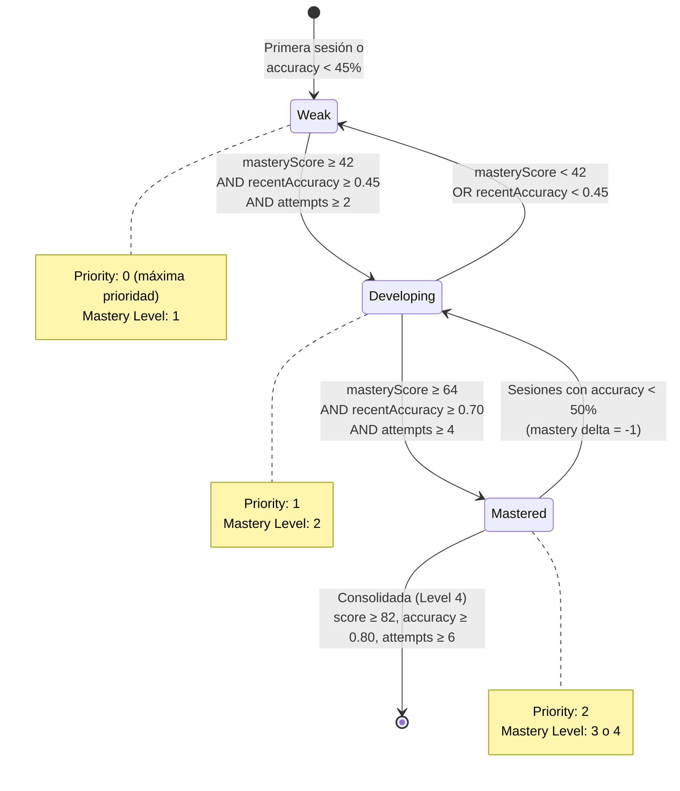
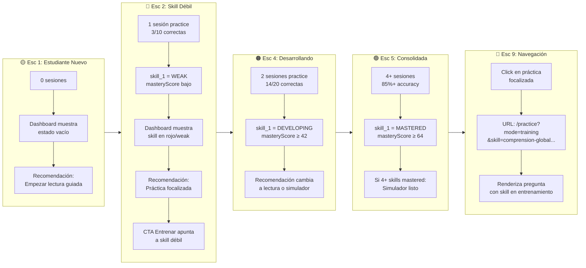
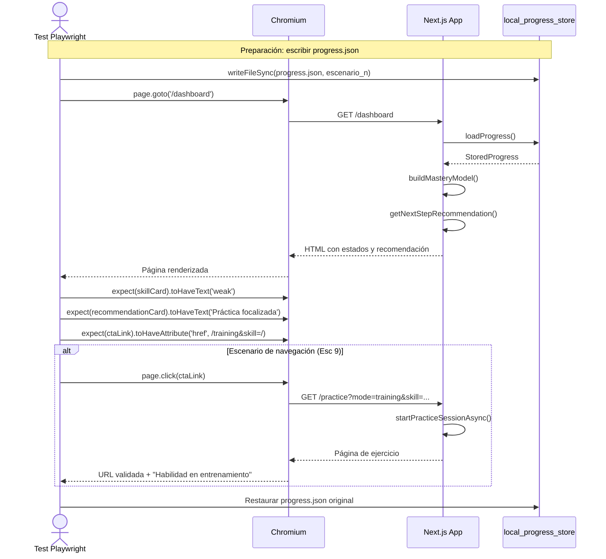
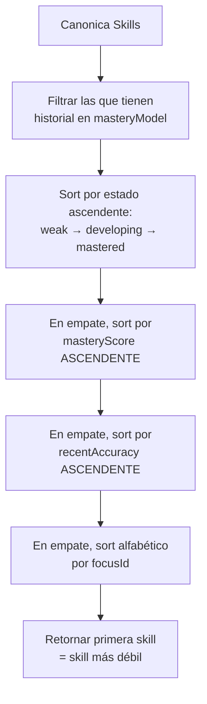

# Esquema Visual: Test E2E – Fortalecimiento de Skills Débiles

Este documento describe la lógica, estados, recomendaciones y flujo de navegación del test end-to-end que valida cómo la plataforma detecta, prioriza y fortalece skills con bajo desempeño.

---

## 1. Máquina de Estados de una Skill

El sistema modela cada skill en uno de tres estados posibles, determinados por el `masteryScore` (0-100), la `recentAccuracy` y el `totalAttempts`.



### Umbrales del Mastery Model

| Estado | Mastery Score | Recent Accuracy | Total Attempts | Level |
|--------|--------------|-----------------|----------------|-------|
| **Weak** | < 42 | < 0.45 | < 2 | 1 |
| **Developing** | ≥ 42 | ≥ 0.45 | ≥ 2 | 2 |
| **Mastered** | ≥ 64 | ≥ 0.70 | ≥ 4 | 3 |
| **Mastered+** | ≥ 82 | ≥ 0.80 | ≥ 6 | 4 |

### Fórmula del Mastery Score

```
masteryScore = clamp(0..100, round(
    weightedAccuracy  * 45
  + recentAccuracy    * 35
  + ((weightedMastery - 1) / 3) * 20
  + readingBonus      (min(5, readingSessions * 1.5))
  + consistencyBonus  (5 if attempts ≥ 8, 2 if ≥ 4)
))
```

- **Peso por recencia**: última sesión = 1.35x, penúltima = 1.2x, antepenúltima = 1.1x
- **Peso por modo**: practice = 1.0x, reading = 1.15x, simulator = 1.25x

---

## 2. Motor de Recomendaciones

El `getNextStepRecommendation` evalúa el historial del estudiante en orden de prioridad y devuelve un único `NextStepRecommendation`.

```mermaid
flowchart TD
    A[Inicio: buildMasteryModel + historial] --> B{Última sesión fue<br/>READING con accuracy < 80%?}
    B -->|Sí| C[Recomendación:<br/>CONTINUE-READING-UNIT]
    B -->|No| D{Última sesión fue<br/>SIMULATOR y hay skill weak?}
    D -->|Sí| E[Recomendación:<br/>REVIEW-WEAK-SKILL]
    D -->|No| F{Simulador listo?<br/>(4+ skills elegibles,<br/>0 weak, avg ≥ 60,<br/>4+ sesiones)}
    F -->|Sí y última no fue simulador| G[Recomendación:<br/>SIMULATOR-READY]
    F -->|No| H{Hay reading units<br/>sin leer?}
    H -->|Sí y (no hay reading reciente<br/>o última fue practice)| I[Recomendación:<br/>START-READING-UNIT]
    H -->|No| J{Existe skill weak?}
    J -->|Sí| K[Recomendación:<br/>TARGETED-PRACTICE]
    J -->|No| L[Recomendación por defecto:<br/>START-READING-UNIT]

    C --> M[Renderizar tarjeta<br/>"Continuar lectura"]
    E --> N[Renderizar tarjeta<br/>"Revisar habilidad"]
    G --> O[Renderizar tarjeta<br/>"Listo para simulación"]
    I --> P[Renderizar tarjeta<br/>"Empezar lectura"]
    K --> Q[Renderizar tarjeta<br/>"Práctica focalizada"]
    L --> R[Renderizar tarjeta<br/>"Iniciar práctica de Lengua"]
```

### Condiciones de Simulador Listo

```mermaid
flowchart LR
    A[totalSessions ≥ 4] --> B{AND}
    C[eligibleSkills ≥ 4<br/>(attempts ≥ 4, level ≥ 2)] --> B
    D[weakSkills === 0] --> B
    E[averageMasteryScore ≥ 60] --> B
    B -->|Todas| F[Simulador listo]
    B -->|Alguna no| G[Simulador NO listo]
```

---

## 3. Flujo del Test E2E Completo

El test simula un estudiante desde su primera sesión hasta la consolidación completa, validando cada transición de estado y recomendación.



---

## 4. Secuencia de Navegación E2E

Interacción real del browser validando clicks, URLs y renderizado de componentes.



---

## 5. Datos de Prueba por Escenario

### Escenario 2: Una Skill Weak
```json
{
  "sessions": [{
    "mode": "practice",
    "total_attempts": 10, "total_correct": 3, "total_errors": 7,
    "skill_results": [
      { "skill_id": "lengua.skill_1", "attempts": 10, "correct": 3,
        "state": "weak", "mastery_level": 1 }
    ],
    "id": "s1",
    "created_at": "2026-04-20T10:00:00.000Z"
  }],
  "skill_stats": {}, "seenSkills": []
}
```
**Resultado esperado**: `skill_1` = weak, recomendación = targeted-practice, CTA apunta a `skill=comprension-global-del-texto`.

### Escenario 3: 1 Weak + 3 Mastered
```json
{
  "sessions": [
    { "mode": "practice", "skill_results": [
      { "skill_id": "lengua.skill_1", "attempts": 10, "correct": 3, "state": "weak", "mastery_level": 1 }
    ]},
    { "mode": "practice", "skill_results": [
      { "skill_id": "lengua.skill_2", "attempts": 8, "correct": 7, "state": "mastered", "mastery_level": 3 },
      { "skill_id": "lengua.skill_3", "attempts": 8, "correct": 7, "state": "mastered", "mastery_level": 3 },
      { "skill_id": "lengua.skill_4", "attempts": 8, "correct": 7, "state": "mastered", "mastery_level": 3 }
    ]}
  ]
}
```
**Resultado esperado**: CTA "Entrenar" apunta a `skill_1` (la weak), no a ninguna mastered.

### Escenario 4: Weak → Developing (2 sesiones, 70%)
```json
{
  "sessions": [
    { "mode": "practice", "skill_results": [
      { "skill_id": "lengua.skill_1", "attempts": 10, "correct": 7, "state": "developing", "mastery_level": 2 }
    ], "created_at": "2026-04-20T09:00:00.000Z" },
    { "mode": "practice", "skill_results": [
      { "skill_id": "lengua.skill_1", "attempts": 10, "correct": 7, "state": "developing", "mastery_level": 2 }
    ], "created_at": "2026-04-20T10:00:00.000Z" }
  ]
}
```
**Resultado esperado**: `skill_1` = developing, recomendación ya NO es targeted-practice (cambia a lectura o simulador).

### Escenario 6: Lectura con Accuracy < 80%
```json
{
  "sessions": [{
    "mode": "reading", "readingUnitId": "RU-LEN-BIO-001",
    "total_attempts": 10, "total_correct": 6,
    "skill_results": [
      { "skill_id": "lengua.skill_1", "attempts": 10, "correct": 6, "state": "developing", "mastery_level": 2 }
    ],
    "id": "s_reading", "created_at": "2026-04-20T11:00:00.000Z"
  }]
}
```
**Resultado esperado**: Recomendación = `continue-reading-unit`, título contiene "Continuar lectura: Violeta Parra".

### Escenario 7: Post-Simulador con Weak
```json
{
  "sessions": [
    { "mode": "simulator", "total_attempts": 20, "total_correct": 16,
      "skill_results": [
        { "skill_id": "lengua.skill_2", "attempts": 8, "correct": 7, "state": "mastered", "mastery_level": 3 }
      ], "created_at": "2026-04-20T08:00:00.000Z" },
    { "mode": "practice", "total_attempts": 10, "total_correct": 3,
      "skill_results": [
        { "skill_id": "lengua.skill_1", "attempts": 10, "correct": 3, "state": "weak", "mastery_level": 1 }
      ], "created_at": "2026-04-20T09:00:00.000Z" }
  ]
}
```
**Resultado esperado**: Recomendación = `review-weak-skill`, título contiene "Revisar habilidad a reforzar".

---

## 6. Prioridad de Skills Débiles

Cuando múltiples skills están en estado weak, el sistema usa esta jerarquía de ordenamiento para decidir cuál priorizar:



---

## 7. Estructura del Archivo de Test

```
tests/e2e/
└── weak-skill-strengthening.spec.ts
    ├── beforeAll: guardar progress.json original
    ├── afterEach: restaurar progress.json
    ├── test("Esc 1: estudiante nuevo muestra empty state")
    ├── test("Esc 2: skill weak genera práctica focalizada")
    ├── test("Esc 3: CTA Entrenar apunta a skill más débil")
    ├── test("Esc 4: weak→developing con accuracy 70%")
    ├── test("Esc 5: developing→mastered con accuracy 85%")
    ├── test("Esc 6: lectura con accuracy < 80% sugiere continuar")
    ├── test("Esc 7: post-simulador con weak sugiere revisión")
    ├── test("Esc 8: simulador listo con 4+ skills consolidated")
    ├── test("Esc 9: navegación de dashboard a /practice")
    └── test("Esc 10: dashboard refleja nuevo estado post-práctica")
```

---

## Referencias

- Motor de estados: `src/progress/mastery_model.ts`
- Motor de recomendaciones: `src/recommendation/next_step.ts`
- Almacenamiento de progreso: `src/storage/local_progress_store.ts`
- Dashboard: `src/app/page.tsx`
- Práctica: `src/app/practice/page.tsx`
